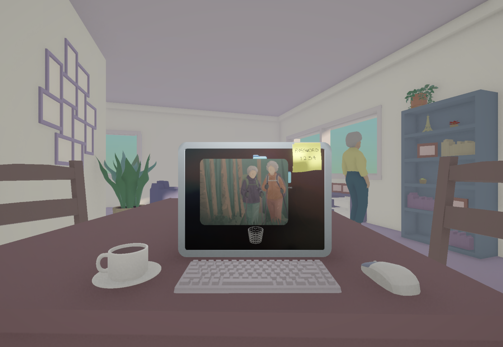

# Dear Friend

## Overview

**Dear Friend** is an interactive storytelling project developed in Unity.  
The project explores care, time, friendship, and intergenerational connection through the relationship between a student and an elderly resident living in the same intergenerational cohabitation building.

What begins as a simple act of help, a student assisting a senior with computer issues, gradually becomes a meaningful bond. Through their conversations and shared moments, both characters begin to affect each other’s lives. The student, who is facing personal pressure and important exams, starts to see his own struggles differently through the senior’s memories, vulnerability, and perspective.

The final experience will take the form of a 3D interactive story, closer to a narrative experience than a traditional game.

## Project Intentions

This project focuses on how care can appear through small gestures, presence, listening, and emotional attention.

# Credits

Asnavandi Alireza, Melissargos Ariadne, Sangnakkara Julia
